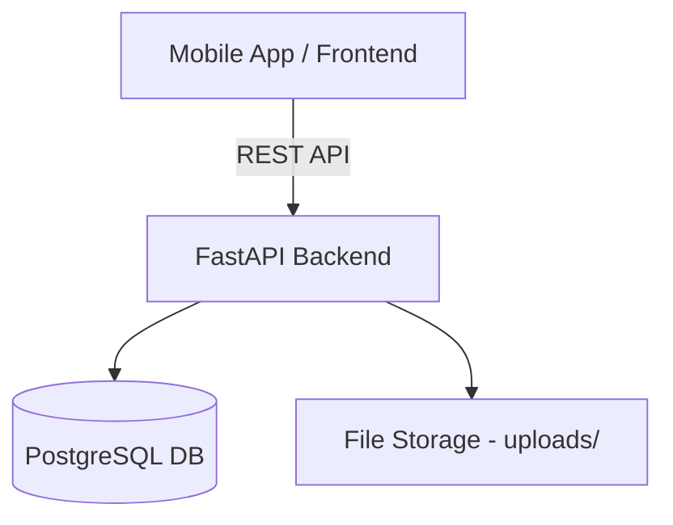
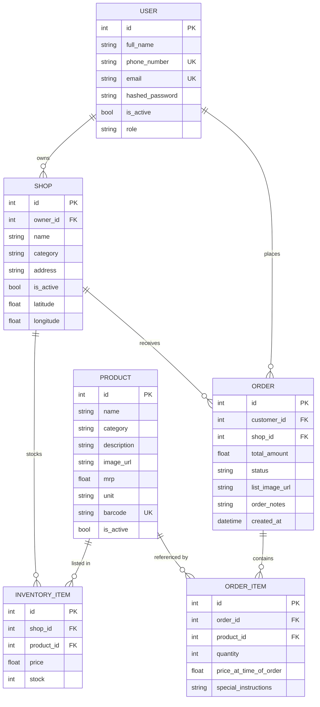
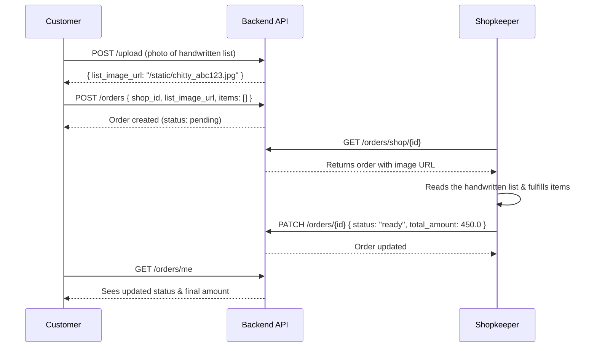

# 🛒 Smart Kirana (Kmart) — Backend API

A **FastAPI + PostgreSQL** backend for a local grocery/kirana store marketplace. Connects **customers** with nearby **shopkeepers**, enabling product browsing, order placement (including handwritten shopping list uploads — the "chitty" workflow), and order lifecycle management.



---

## ⚙️ Tech Stack

| Layer | Technology |
|-------|-----------|
| Framework | [FastAPI](https://fastapi.tiangolo.com/) |
| Database | PostgreSQL 16 (via Docker) |
| ORM | SQLAlchemy |
| Auth | JWT ([PyJWT](https://pyjwt.readthedocs.io/)) + bcrypt ([passlib](https://passlib.readthedocs.io/)) |
| Config | pydantic-settings + `.env` |
| Server | Uvicorn |

---

## 📁 Project Structure

```
kmart-backend/
├── app/
│   ├── main.py              # App entry point, route registration
│   ├── api/                  # Route handlers
│   │   ├── auth.py           # Register + Login
│   │   ├── products.py       # CRUD for product catalog
│   │   ├── shops.py          # Create / list shops
│   │   ├── inventory.py      # Per-shop inventory management
│   │   ├── orders.py         # Order lifecycle
│   │   └── upload.py         # Image upload for handwritten lists
│   ├── models/               # SQLAlchemy ORM models
│   │   ├── user.py
│   │   ├── product.py
│   │   ├── shop.py
│   │   ├── inventory.py
│   │   └── order.py
│   ├── schemas/              # Pydantic request/response schemas
│   │   ├── user.py
│   │   ├── product.py
│   │   ├── shop.py
│   │   ├── inventory.py
│   │   └── order.py
│   ├── core/
│   │   ├── config.py         # Settings (DB URL, JWT secret, etc.)
│   │   └── security.py       # Password hashing + JWT creation
│   ├── db/
│   │   ├── base.py           # SQLAlchemy declarative base
│   │   └── session.py        # Engine + session factory
│   └── utils/
│       └── auth.py           # get_current_user dependency (JWT decode)
├── seed_products.py          # Script to seed sample products
├── docker-compose.yml        # PostgreSQL container
├── requirements.txt
└── .env                      # DATABASE_URL
```

---

## 🚀 Getting Started

### Prerequisites

- **Python 3.10+**
- **Docker** (for PostgreSQL)

### 1. Clone the repository

```bash
git clone https://github.com/kirankumar3117/kmart-backend.git
cd kmart-backend
```

### 2. Start PostgreSQL via Docker

```bash
docker-compose up -d
```

This starts a PostgreSQL 16 container on **port 5433** with:
- User: `postgres`
- Password: `admin123`
- Database: `kmart_db`

### 3. Set up the Python environment

```bash
python -m venv venv
source venv/bin/activate
pip install -r requirements.txt
```

### 4. Run the server

```bash
uvicorn app.main:app --reload
```

The API will be available at **http://localhost:8000**

### 5. Explore the API docs

FastAPI auto-generates interactive docs:

| Docs | URL |
|------|-----|
| Swagger UI | http://localhost:8000/docs |
| ReDoc | http://localhost:8000/redoc |

### 6. (Optional) Seed sample products

```bash
python seed_products.py
```

---

## 🗄️ Data Model



### Key Relationships

- **`InventoryItem`** bridges `Shop` ↔ `Product` — each shop sets its own **price** and **stock** for a product from the master catalog
- **`Order`** links a customer to a shop; **`OrderItem`** links an order to specific products
- `product_id` is **optional** on `OrderItem` to support the "chitty" (handwritten list upload) workflow

---

## 📡 API Endpoints

### 🔐 Auth — `/api/v1/auth`

| Method | Path | Auth | Description |
|--------|------|------|-------------|
| `POST` | `/register` | Public | Register with phone, name, password, optional email & role |
| `POST` | `/login` | Public | Login with phone + password + role → returns JWT |

### 📦 Products — `/api/v1/products`

| Method | Path | Auth | Description |
|--------|------|------|-------------|
| `POST` | `/` | Public | Create a new product (admin use) |
| `GET` | `/` | Public | Search/list products (`?search=` and `?category=` filters) |

### 🏪 Shops — `/api/v1/shops`

| Method | Path | Auth | Description |
|--------|------|------|-------------|
| `POST` | `/` | 🔒 Shopkeeper | Create a shop (owner_id from JWT) |
| `GET` | `/` | Public | List all shops |

### 📋 Inventory — `/api/v1/inventory`

| Method | Path | Auth | Description |
|--------|------|------|-------------|
| `POST` | `/` | Public | Add product to a shop's inventory |
| `GET` | `/shop/{shop_id}` | Public | Get a shop's full inventory |
| `PATCH` | `/{item_id}` | Public | Update price/stock of an inventory item |

### 🛒 Orders — `/api/v1/orders`

| Method | Path | Auth | Description |
|--------|------|------|-------------|
| `POST` | `/` | 🔒 Customer | Place an order (digital items + optional image list) |
| `GET` | `/shop/{shop_id}` | 🔒 Shopkeeper | View all orders for a specific shop |
| `PATCH` | `/{order_id}` | 🔒 Shopkeeper | Update order status / total amount |
| `GET` | `/me` | 🔒 Logged-in | View customer's own order history |

### 📸 Upload — `/api/v1/upload`

| Method | Path | Auth | Description |
|--------|------|------|-------------|
| `POST` | `/` | Public | Upload an image file → returns `/static/{filename}` URL |

---

## 🧾 The "Chitty" Workflow

A unique feature allowing customers to **photograph a handwritten shopping list** and submit it as an order:



---

## 🔑 Authentication Flow

1. **Register** → password is bcrypt-hashed → stored in DB
2. **Login** → password verified → JWT created with `user.id` as `sub` claim (valid for **7 days**)
3. **Protected routes** use `get_current_user` dependency → decodes JWT → fetches user from DB
4. **Role-based access**: `customer`, `shopkeeper`, `admin`

---

## 🧑‍💻 User Roles

| Role | Capabilities |
|------|-------------|
| **Customer** | Browse products/shops, place orders, view own orders, upload images |
| **Shopkeeper** | Create shops, manage inventory, view/update shop orders |
| **Admin** | Manage product catalog (to be expanded) |

---

## 📝 Environment Variables

| Variable | Description | Default |
|----------|-------------|---------|
| `DATABASE_URL` | PostgreSQL connection string | *(required)* |
| `SECRET_KEY` | JWT signing key | `your-super-secret-key-...` |
| `ALGORITHM` | JWT algorithm | `HS256` |
| `ACCESS_TOKEN_EXPIRE_MINUTES` | Token TTL in minutes | `10080` (7 days) |

---

## 📄 License

This project is for educational and personal use.
